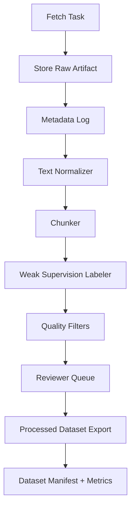

# ML Training Data Pipeline Blueprint

Last updated: 2025-09-26

This document defines the end-to-end pipeline for sourcing, cleaning, labeling, and packaging training data that powers the category-specific ML models used in the Terms Guardian User Rights Index.

## 🎯 Objectives

- Deliver high-quality labeled corpora for each of the eight URI categories.
- Ensure reproducible, auditable data flows with version control and licensing notes.
- Balance weak supervision, automated heuristics, and expert annotation to keep costs low while maintaining precision.

## 🧱 High-Level Architecture

1. **Source Harvesting** → download public/legal documents per category (with license metadata).
2. **Raw Staging** → store unmodified documents under `data/raw/<source>/<yyyymmdd>/`.
3. **Normalization & Chunking** → convert to UTF-8 text, strip boilerplate, segment into 300–600 word spans.
4. **Weak Supervision Labeling** → apply category-specific pattern rules to generate provisional labels & confidence scores.
5. **Quality Gates** → deduplicate, run profanity/legal language filters, and compute heuristics (readability, length, overlap).
6. **Annotation & Review** → sample-based manual validation with legal SMEs; capture overrides and rationales.
7. **Packaging & Versioning** → publish cleaned datasets under `data/processed/<category>/<version>/` with manifest files.
8. **Metrics & Reporting** → generate dataset cards with size, class balance, and quality KPIs per release.

## 📚 Primary Data Sources by Category

| URI Category           | Core Sources                                                                 | Supplemental Sources                         |
| ---------------------- | ---------------------------------------------------------------------------- | -------------------------------------------- |
| Clarity & Transparency | Plain-language ToS exemplars (ToS;DR A-rated), open-source policy templates  | Style guides, consumer rights advisories     |
| Data Collection & Use  | GDPR, CCPA/CPRA, privacy policies from major platforms                       | FTC consent decrees, PolicyQA dataset        |
| User Privacy           | Privacy class action filings, EDPB guidance, CNIL rulings                    | Academic privacy research papers             |
| Content Rights         | Creative Commons licenses, SaaS IP clauses, DMCA notices                     | Contract clause databases (CUAD/LEDGAR)      |
| Account Management     | Churn/termination policies, subscription agreements                          | BBB arbitrations, consumer complaint portals |
| Dispute Resolution     | Arbitration agreements, AAA rules, class action waivers                      | Court opinions on enforceability             |
| Terms Changes          | Unilateral modification clauses, change logs, product update notices         | Legal commentary on contract amendments      |
| Algorithmic Decisions  | AI transparency statements, EU AI Act drafts, automated decision disclosures | Regulatory sandboxes, AI ethics policies     |

Each harvested document must be logged in `data/raw/_sources.csv` with: `source_id`, `category`, `license`, `url`, `retrieved_at`, `notes`.

## ⚙️ Ingestion Workflow



### Scripts & CLI Entrypoints (planned)

| Command                                                                    | Description                      | Output                                    |
| -------------------------------------------------------------------------- | -------------------------------- | ----------------------------------------- |
| `npm run ml:harvest -- --source gdpr`                                      | Download and stage GDPR corpus   | `data/raw/gdpr/<date>/`                   |
| `npm run ml:normalize -- --input data/raw/gdpr --category data_collection` | Convert raw docs to cleaned text | `data/normalized/gdpr/*.txt`              |
| `npm run ml:chunk -- --input data/normalized --chunk-size 500`             | Segment documents into spans     | `data/chunks/<category>/*.jsonl`          |
| `npm run ml:label -- --category data_collection`                           | Apply weak supervision rules     | `data/labeled/<category>/<version>.jsonl` |
| `npm run ml:qc -- --category data_collection`                              | Run dedupe & quality gates       | `reports/qc/<category>/<date>.json`       |

> Scripts will live under `scripts/corpus/` with shared utilities in `scripts/corpus/lib/`.

## 🧹 Normalization & Preprocessing

- **Encoding**: enforce UTF-8, convert PDFs via OCR when needed (log confidence).
- **Boilerplate Removal**: strip navigation, cookie banners, signatures using DOM heuristics & regex guards.
- **Citation Stripping**: remove footnotes & inline legal citations (retain markers in metadata for reversibility).
- **Language Detection**: keep English subset for MVP; tag non-English segments for future use.
- **Deduplication**: MinHash/SimHash across chunks with Jaccard >0.85 threshold removed.
- **Readability Bounds**: flag segments with <80 or >3,000 characters for manual review.

## 🧪 Labeling Strategy

### Weak Supervision Rules

- Pattern libraries per category stored in `scripts/corpus/patterns/<category>.yaml`.
- Rules emit `(label, confidence)` pairs; confidences capped at 0.9 to leave headroom for manual overrides.
- Multi-label support (e.g., a clause may hit Data Collection + Algorithmic Decisions).

### Assisted Triage

- Stratified sampling of low-confidence (<0.4) and high-impact (>0.8) predictions pushed to reviewer queues.
- Reviewer UI (future) consumes JSONL and surfaces canonical context + suggested label.

### Manual Annotation

- Annotation guidelines maintained in `docs/ml/annotation-guidelines.md` (to be authored).
- Minimum inter-annotator agreement target: κ ≥ 0.75 per category.
- Reviewer metadata (`annotator_id`, `decision`, `confidence`, `notes`) appended to records.

## 📦 Packaging & Versioning

- Processed datasets released under semantic versions (`vYYYY.MM.DD`), e.g., `data/processed/data_collection/v2025.09.30.jsonl`.
- Each release must include a manifest `dataset.json` with:

  ```json
  {
    "category": "data_collection",
    "version": "v2025.09.30",
    "records": 18450,
    "label_distribution": {
      "data_collection_extensive": 0.41,
      "purpose_broad": 0.37,
      "consent_implied": 0.22
    },
    "sources": ["gdpr", "ccpa", "ftc_consent"],
    "qa_sample_size": 300,
    "qa_accuracy": 0.87,
    "notes": "Expanded FTC consent decrees"
  }
  ```

- Store manifests alongside README-style dataset cards summarizing provenance, ethical considerations, and licensing.

## ✅ Quality Gates

1. **Structural**: No missing `text`, `labels`, or `source` fields; UTF-8 encoding validated.
2. **Deduplication**: Within-category near-duplicates removed; cross-category duplicates flagged.
3. **Label Balance**: Each URI category maintains ≥2,000 labeled spans with class imbalance ratio <4:1.
4. **Manual QA**: Minimum 300 reviewed samples per category; error rate <10% before release.
5. **Compliance**: Licensing verified; sensitive personal data redacted where required.

## 🗂️ Storage & Access

- Raw data lives under `data/raw/` (git-ignored) with `.gitkeep` placeholders in repo.
- Processed & labeled datasets published to a private object store or encrypted artifact registry; only manifests kept in git.
- Training scripts consume datasets via environment-configured paths (e.g., `DATA_ROOT` env var).

## 🔁 Maintenance Cadence

- **Monthly Harvest**: Refresh regulatory/legal sources and append delta records.
- **Quarterly Recalibration**: Retrain models if dataset delta >20% or performance dips below SLA.
- **Ad-hoc Hotfixes**: For high-severity false positives/negatives raised by QA or users.

## 📌 Next Deliverables

- [ ] Stand up `scripts/corpus/` scaffold with shared utilities and CLI wrappers.
- [ ] Write annotation guidelines and SME onboarding docs (`docs/ml/annotation-guidelines.md`).
- [ ] Produce initial manifests for Data Collection & Liability categories.
- [ ] Integrate dataset metrics into CI checks (fail if manifest missing or QA coverage below threshold).

This blueprint will evolve as we execute the workstreams documented in `docs/ml-enhancement-plan.md` and `docs/roadmap-and-todos.md`.
